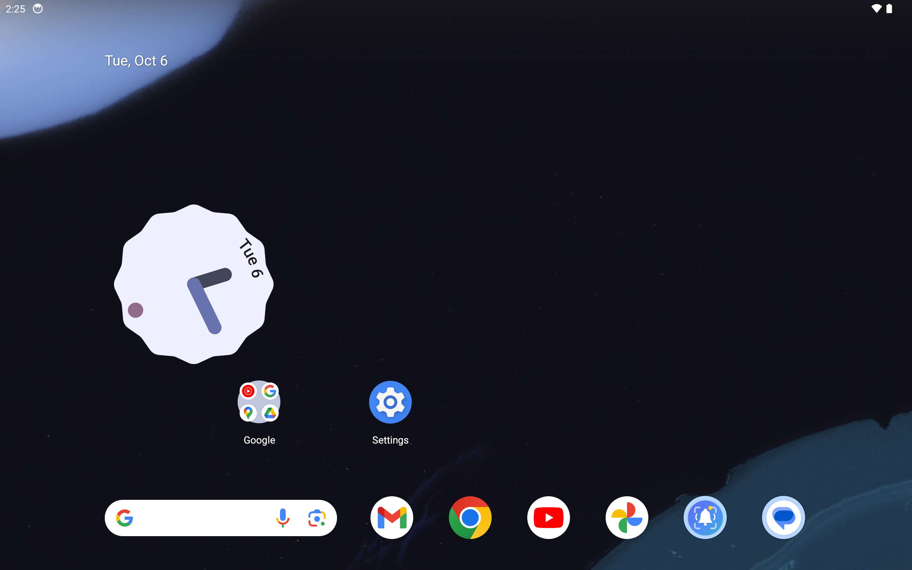
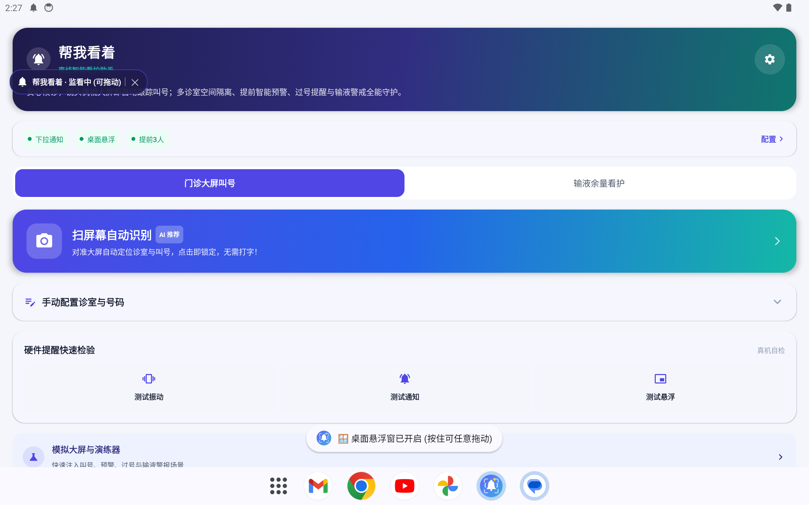
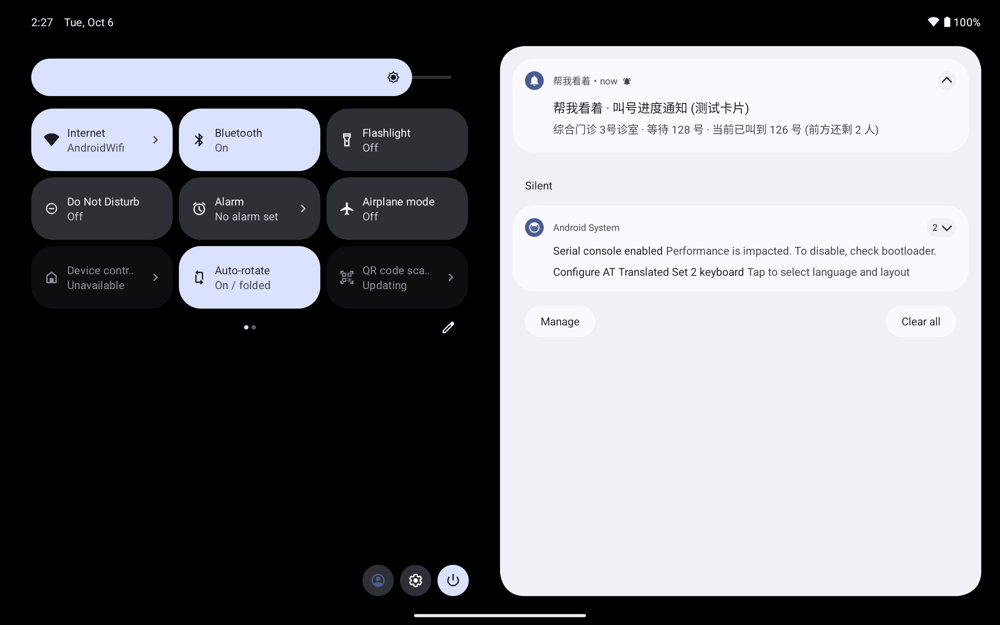
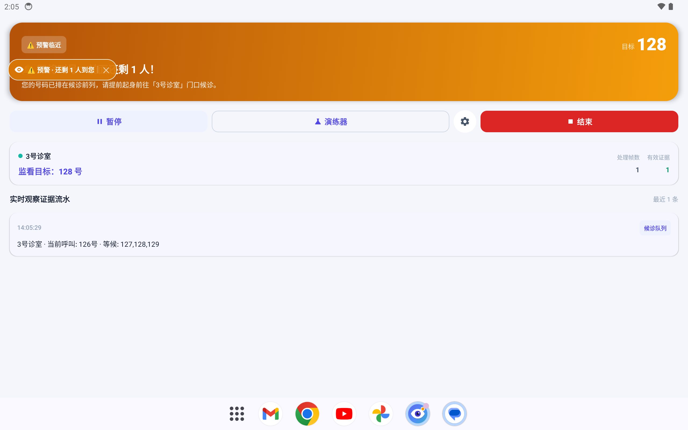
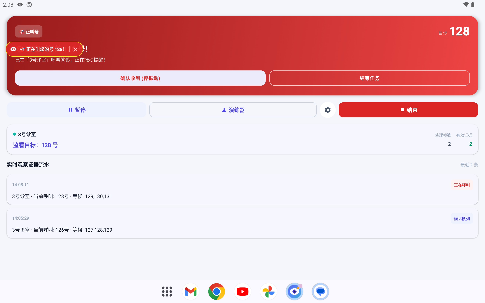

# 帮我看着 (Ding-App) 🏥🔔

[](https://github.com/lusipad/ding-app/actions/workflows/ci.yml)
[](https://github.com/lusipad/ding-app/releases)
[](https://opensource.org/licenses/MIT)
[](https://android-arsenal.com/api?level=26)
[](https://kotlinlang.org)
[](https://developer.android.com/jetpack/compose)

> **让候诊更从容，让看护更省心。**  
> 一款专为就医候诊、输液陪护打造的现代化**纯本地离线智能视觉看护助手**（Android）。

---

## 📖 项目简介

在拥挤嘈杂的医院候诊区，患者与家属往往不得不时刻紧盯叫号大屏，生怕错过叫号或过号，极度消耗精力且容易焦虑。  
**「帮我看着」** 旨在解决这一痛点：无需用户全程紧盯，只需在偶视或对准大屏时，利用手机摄像头**全离线、零上传**地自动捕获叫号动态；一旦即将轮到、正在叫号或疑似过号，立刻通过**强力振动、下拉状态栏常驻卡片、桌面拖拽悬浮胶囊**多重通道进行强力提醒。

---

## 📱 界面与实机效果预览

| 🎨 全新极简图标设计 | 🏠 现代 Material 3 首页 | 🪟 桌面悬浮窗实时监控 |
| :---: | :---: | :---: |
|  |  |  |
| **取景框 + 金色铃铛**<br>告别惊悚眼睛设计，温暖护航 | **Hero 状态大卡片**<br>分段胶囊与全离线就绪指示 | **系统级半透明胶囊**<br>切回微信/桌面自由拖拽感知 |

| 📬 下拉通知栏动态同步 | ⏳ 提前预警态（金色） | 🚨 命中强提醒态（红色） |
| :---: | :---: | :---: |
|  |  |  |
| **极简铃铛通知**<br>状态栏无白块，实时显示前方人数 | **倒数预警联动**<br>提前 2~3 人震动提醒起身候诊 | **声振视三合一**<br>红光脉冲闪烁与高优先级触感 |

---

## 📥 快速体验与下载

您可以直接前往 [GitHub Releases](https://github.com/lusipad/ding-app/releases) 页面，下载最新预编译的 `ding-app-v1.0.0.apk` 直接安装到 Android 手机：

- 📦 **最新发布包**：[Ding-App v1.0.0 (GitHub Releases)](https://github.com/lusipad/ding-app/releases/latest)
- ⚙️ **权限说明**：安装后请根据系统引导授予「相机权限」（用于完全离线捕获大屏画面）及「悬浮窗权限」（用于开启桌面小胶囊实时查看）。

---

## ✨ 核心特性

### 1. 🏥 医院叫号智能看护
- **📸 扫屏幕自动识别（AI 极速锁定）**：对准候诊大屏自动框选诊室与叫号，点选即锁，零繁琐打字输入。
- **🧩 多科室空间几何隔离**：精准关联“诊室名”与对应叫号区域，邻近诊室叫同名号严格忽略，杜绝虚假误报。
- **⏱️ 提前智能预警（倒数叫号）**：自定义提前 $N$ 人（默认 2~3 人）提醒起身候诊，留足前往诊室的时间。
- **⚠️ 显式与隐式过号双重追踪**：
  - **显式过号**：在大屏过号栏/未到栏中精准捕获目标号码并强提醒。
  - **隐式翻号越界**：诊室叫号已显著超过目标号码时，自动判定并提醒尽快前往分诊台。

### 2. 🧪 输液余量警戒实验
- **💧 低液位智能预警**：对准硬质输液瓶，自动识别药液水平面；当剩余药液低于设定警戒线（默认 15%）时触发急促警报，提醒护士换瓶。

### 3. 🔔 全场景强力提醒系统
- **📳 强力震动提醒**：针对预警、叫号命中与过号采用差异化振动节奏，身处嘈杂就医环境或手机放口袋依然清晰感知。
- **📬 下拉通知栏动态进度**：常驻通知卡片随叫号进度实时刷新（前方还剩 $N$ 人），使用极简小矢量图标，杜绝状态栏白方块。
- **🪟 桌面半透明悬浮胶囊**：切回微信、刷短视频或回到桌面时，悬浮胶囊实时显示叫号动态；支持全屏自由拖动、一键关闭与状态情绪变色（蓝/金/红）。

### 4. 🔒 100% 纯本地离线计算与隐私安全
- 所有文字检测、几何聚类与图像分析全部在设备本地端侧完成（基于 ML Kit 离线文本识别与端侧视觉分析）。
- **不上传任何摄像头画面、不保存患者敏感面部与隐私信息**，无网络依赖，医疗隐私零泄露风险。

### 5. 🧪 内置大屏演练器（Simulator）
- 内置覆盖全流程的测试与演练工具箱，一键注入预警、命中、过号、多诊室干扰与输液警报等真实业务流，支持在无物理大屏环境下全链路自测。

---

## 🎨 现代设计规范

- **全新的视觉隐喻**：
  - **智能取景框（Focus Viewfinder）**：外围四角圆润对焦框线，象征 AI 视觉看护；
  - **灵动暖心铃铛（Ding Bell）**：中心饱满圆润的白色守护铃铛与动态音浪，代表“叫号了叮一下提醒”，温暖亲切；
  - **底色渐变**：静谧深靛蓝（`#4F46E5`）至天蓝（`#3B82F6`）及青绿（`#14B8A6`），兼顾专业医疗感与高质感科技感。
- **Material 3 规范升级**：
  - 情绪感知 Hero 状态大卡片（巡视蓝/预警金/警报红自适应流转）；
  - 现代分段胶囊切页器（Segmented Pills）；
  - 32sp 粗体目标号码与实时状态脉冲点；
  - 时间轴式清晰证据流水展示。

---

## 🛠️ 技术栈与架构

- **语言与构建**：Kotlin 1.9+, Gradle Kotlin DSL
- **UI 框架**：Jetpack Compose + Material 3, Compose Navigation
- **架构模式**：MVVM + StateFlow 响应式状态流
- **视觉与识别引擎**：
  - Google ML Kit Text Recognition（On-device 本地离线引擎）
  - CameraX（轻量抽帧与后台间歇巡视调度）
  - 端侧几何空间聚类算法（Clinic-Number Spatial Clustering）
- **系统能力**：
  - WindowManager（系统级桌面可拖动悬浮窗）
  - NotificationCompat（高优先级前台服务与常驻动态通知）
  - Vibrator / VibrationEffect（精细化振动节律）
- **兼容性**：
  - 最低支持：Android 8.0 (API 26)
  - 目标版本：Android 14 (API 34)

---

## 📂 项目结构

```text
ding-app/
├── app/
│   ├── src/main/java/com/bangwokanzhe/app/
│   │   ├── model/             # 领域模型（Task、Observation、MonitorState等）
│   │   ├── ocr/               # 离线屏幕识别与空间几何匹配算法
│   │   ├── infusion/          # 输液瓶边缘与液面检测实验模块
│   │   ├── state/             # 状态机与防抖判定引擎
│   │   ├── notification/      # 振动、系统通知管理器
│   │   ├── service/           # 前台相机间歇巡视服务
│   │   ├── ui/
│   │   │   ├── screens/       # HomeScreen, MonitorDashboardScreen, ScanSetupScreen 等
│   │   │   ├── overlay/       # FloatingOverlayManager（桌面悬浮窗）
│   │   │   └── theme/         # Material 3 配色、字阶与形状系统
│   │   └── MainActivity.kt
│   └── src/main/res/          # 自适应图标、矢量图、主题配置
├── dataset/                   # 基准场景测试集与大屏样本
├── scripts/                   # 自动化测试与大屏数据集评估脚本
├── build.gradle.kts
└── settings.gradle.kts
```

---

## 🚀 编译与运行

### 1. 环境要求
- Android Studio Hedgehog 或更高版本
- JDK 17
- Android SDK (API 34)

### 2. 常用构建命令
```bash
# 执行全部单元测试
./gradlew testDebugUnitTest

# 构建 Debug APK
./gradlew assembleDebug

# 构建 Release APK
./gradlew assembleRelease
```

---

## 📄 开源许可

本项目遵循 MIT License 许可协议。
